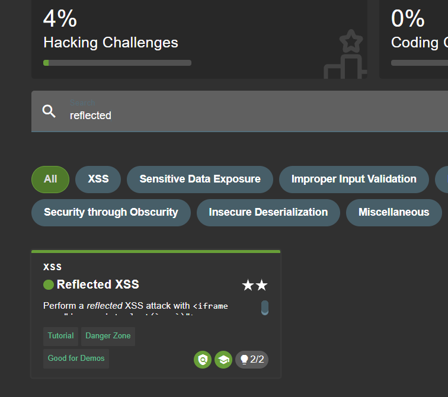
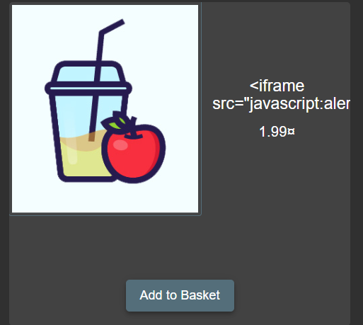
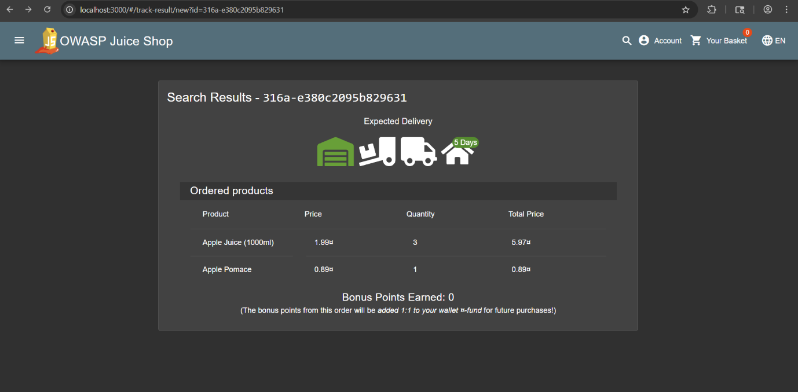
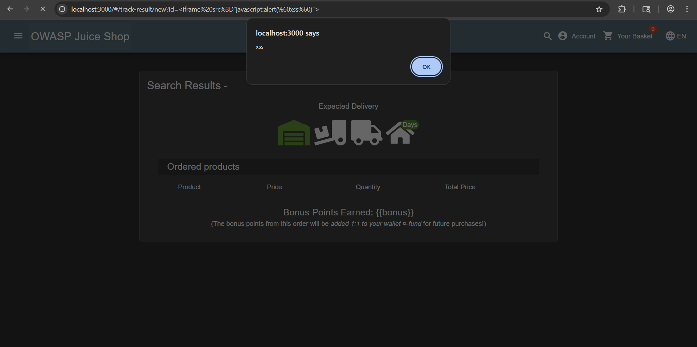
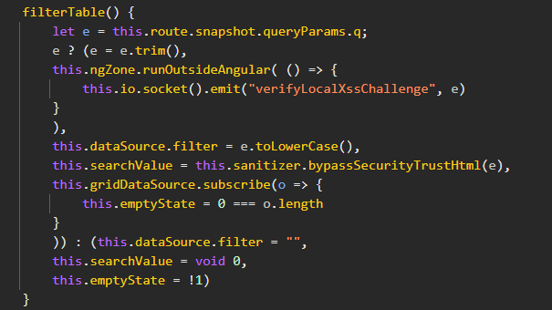
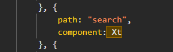
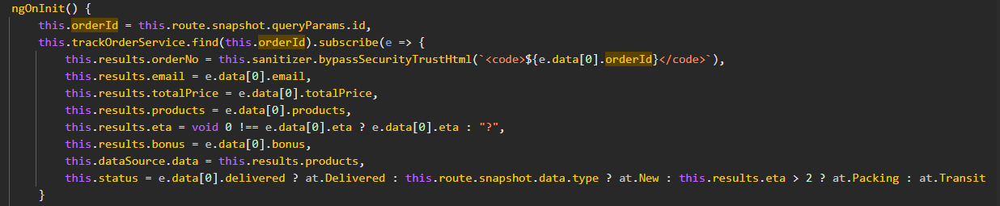

# 04_XSS

## Introduction
In this lab session, we were required to complete and discuss the differences between two challenges available in the OWASP Juice Shop: a DOM-based Cross-Site Scripting (XSS) attack and a reflected Cross-Site Scripting (XSS) attack.

## Solving the DOM XSS challenge
To perform the first attack, the required steps were relatively straightforward. The objective was to identify a method of manipulating the Document Object Model (DOM) in order to successfully complete the challenge. An initial attempt was made to analyse intercepted HTTP traffic using Burp Suite. This was a flawed approach, as DOM-based XSS vulnerabilities arise from insecure client-side JavaScript handling of user input. As a result, this approach did not reveal any suitable entry points that would allow direct DOM manipulation

The investigation therefore shifted towards analysing user-controllable inputs present on the Juice Shop website, specifically the search functionality. When a value is entered into the search bar, the application generates the following URL:

http://localhost:3000/#/search?q=TEST

Given that the vulnerability was DOM-based XSS, modifying the query parameter allowed arbitrary JavaScript execution within the browser. By altering the parameter to:

http://localhost:3000/#/search?q=<iframe src="javascript:alert(\xss`)">

a JavaScript alert was successfully triggered, displaying the message “xss” on the screen. This confirmed the presence of a DOM-based Cross-Site Scripting vulnerability and completed the challenge.

## Solving the Reflected XSS challenge
To complete the second attack, it was first necessary to disable safetyMode within the OWASP Juice Shop configuration. As the application was deployed using Docker, this required modifying a configuration file inside the running container.
Specifically, the default.yml configuration file was copied from the Docker container to the local Windows system using the following PowerShell command:
- docker cp d39623d2e014:/juice-shop/config/default.yml ./default.yml
  
This command copies the configuration file from the container to the local directory, allowing it to be edited externally. Within the file, the parameter safetyMode: auto was identified and changed to safetyMode: disabled.
After saving the modified configuration file, it was copied back into the Docker container using the following command:
- docker cp ./default.yml d39623d2e014:/juice-shop/config/default.yml
  
Once the updated configuration was applied, safety mode was successfully disabled, enabling access to the previously unavailable (greyed-out) challenges.

Initially, the same initial approach was attempted by injecting the alert payload (<iframe src="javascript:alert(\xss`)">) into the query parameter following q=`. However, this did not successfully complete the challenge, indicating that the vulnerability differed from the previous DOM-based XSS scenario.

Subsequently, various potential attack vectors were explored. The language selection functionality was tested but proved ineffective, as it relies on a controlled drop-down menu rather than free-form user input. Additional attempts were made by entering the payload into address input fields; however, these inputs did not result in script execution.

Further investigation involved attempting to modify product names to include the payload, as product names are displayed in a pop-up notification after an item is added to the cart. Despite this being a plausible injection point, this approach also failed to trigger the vulnerability.

 Following these unsuccessful attempts, items were added to the shopping cart and the checkout process was initiated, as this stage contained multiple user-input fields that could potentially be vulnerable. However, testing these fields did not result in script execution.

Upon completion of the transaction, a confirmation page was displayed with a link to a tracking page. This page closely resembled the interface encountered in the earlier DOM-based XSS challenge, as it included a user-controllable parameter within the URL (id=). Recognising this as a potential injection point, the payload <iframe src="javascript:alert(\xss`)"> was appended to the id parameter.

This modification successfully triggered a JavaScript alert, confirming the presence of a reflected Cross-Site Scripting vulnerability, completing the challenge.

## Discussing the Differences

### Looking "Under the hood"
Although the two challenges appear very similar from a user’s perspective, they differ significantly in their underlying implementation. For this reason, it was necessary to examine the application “under the hood” by analysing the client-side source code.

To access the source code, Chrome Developer Tools were used, navigating to the Sources tab. Within this section, several JavaScript files were identified, most notably main.js. Inspection of this file quickly revealed the relevant logic responsible for processing and handling user input, providing insight into how the application renders and executes the supplied data.

### DOM XSS challenge

In the DOM XSS challenge, the vulnerability is located in the search functionality. The /search route is handled by the Xt component, which processes the user-controlled q query parameter.
Within the filterTable() function, the value of q is read from this.route.snapshot.queryParams.q and assigned to the variable e. This value is then passed directly to this.sanitizer.bypassSecurityTrustHtml(e), explicitly disabling Angular’s built-in HTML sanitization.
When this trusted value is subsequently rendered into the DOM, attacker-supplied HTML or JavaScript is executed in the context of the application’s origin.
Since the payload is never sent to or reflected by the server, and is handled entirely on the client side, we are talking about a DOM-based XSS vulnerability.

### Reflected XSS challenge

For the reflected XSS challenge, searching for orderId within the main.js file led to the ngOnInit function, which is responsible for initialising the component and processing parameters when the page is loaded.

Here we can see that the orderId parameter is first sent to the backend via trackOrderService.find(). The backend reflects this user-controlled value back in its JSON response (e.data[0].orderId).

Upon receiving the response, the client application renders this value into the DOM using bypassSecurityTrustHtml, explicitly disabling Angular’s built-in HTML sanitization. As a result, attacker-supplied JavaScript is executed by the browser in the context of the application’s origin.

Although the payload is not reflected in server-generated HTML, it is reflected through the backend and becomes exploitable when the client-side code unsafely renders the response, making this a reflected XSS vulnerability.

### Conclusion
The primary distinction between these two cases lies in the origin of the payload at the time of execution. The search bar vulnerability is labelled DOM-based because the entire exploit cycle occurs within the client’s browser; the malicious script is pulled from the local environment (the URL) and pushed into a sink by local code. The tracking ID vulnerability is labelled Reflected because the payload must travel to the web server and be returned (reflected) in a response before it is rendered into the page.

## References

- Course slides (04_XSS.pdf)
- https://angular.dev/api/platform-browser/DomSanitizer
- https://angular.dev/

