# **06_AITM_1**

This lab activity focuses on analyzing HTTPS security mechanisms, particularly HSTS, by performing and evaluating SSLStrip attacks using Burp Proxy.


## Tools

- Curl
- Burp Suite

## Preliminary activity
The preliminary activity involved examining some web pages to identify their HTTP/HTTPS configuration and HSTS support. The collected information will be used as input for the subsequent lab analysis.

The full results can be found in the excel file inside the src folder of the github repository for this lab activity.

20 web pages were examined using ```curl -I <http://domain>``` followed by ```curl -I <https://domain>```. This made the analysis of the status codes and headers quite straightforward.

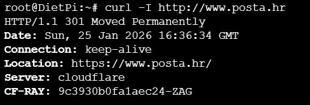
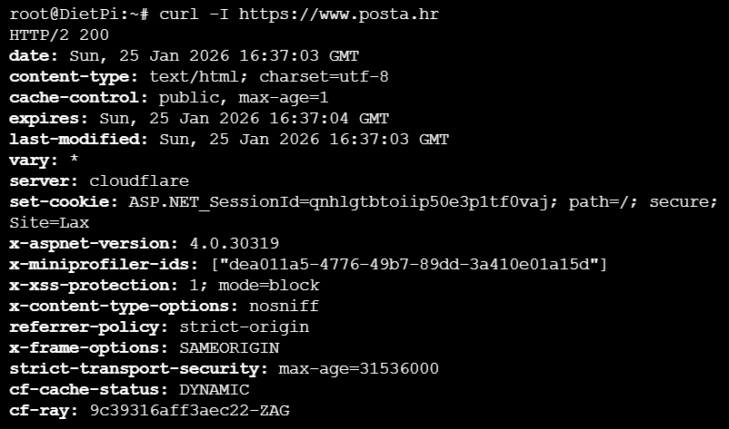

Examining the gathered data from the excel table we can clearly see a few patterns: 

- Web pages using HSTS (via HTTPS): 11
- Web pages with HSTS configured over HTTP (wrong configuration): 2
- Web pages that do not respond to HTTP: 1

The key takeaway from this analysis is that most of the examined websites correctly enforce HTTPS by redirecting HTTP traffic, and over half implement HSTS, significantly reducing the effectiveness of SSLStrip attacks, although a small number still exhibit misconfigurations or block http entirely. Note that the roughly 50% addoption is a rough rappresentation of the real world deployment, which, according to [w3techs.com](https://w3techs.com/technologies/details/ce-hsts) sits around 31.5%. Increasing the number of tested websites would likely cause the measured value to converge toward this percentage.

According to [MDN](https://developer.mozilla.org/en-US/docs/Web/HTTP/Reference/Headers/Strict-Transport-Security#directives), a Strict-Transport-Security policy with a max-age of at least one year is acceptable, although a duration of two years is recommended for robust protection. Furthermore, if a host accepts insecure HTTP requests, it should respond with a permanent redirect (e.g., HTTP 301) to an HTTPS URL, and the Strict-Transport-Security header must be sent only over HTTPS, never in response to an HTTP request. While most analyzed websites comply with this behavior, some deviations were observed. In particular, apple.com and inps.it incorrectly include the HSTS header in HTTP responses, representing a misconfiguration that diverges from the specification. Additionally, comune.trieste.it does not respond to HTTP requests at all, effectively blocking insecure access rather than redirecting it, and predsjednik.hr has set ```max-age=0, includeSubDomains``` but, as per MDN, that has no effect on includeSubDomain since the domain that specified includeSubDomains is immediately deleted from the HSTS hosts list; So since ```max-age=0``` disables HSTS including ```includeSubDomains``` in this context appears to also be a misconfiguration. 

In conclusion, the analyzed data indicates that large corporations are generally more likely to implement HSTS, whereas smaller brands and organizations tend to adopt this security mechanism less frequently. Naturally, there also are exceptions to this trend, as can be seen in the table.


## CASE A
The following activity explores the practical implementation of an SSLStrip attack using Burp Proxy, demonstrating how traffic on a site without HSTS can be intercepted and subsequently modified to compromise sensitive data.

To configure Burp we need to go to: ```Settings → Proxy listeners → Edit the only interface → Request handling → Force use of TLS```. 
We then also need to configure a few rules. Specifically go to: ``` Settings → Proxy → Response modification rules ``` and we need to enable ```Convert HTTPS links to HTTP``` and ```Remove secure flag from cookies```.


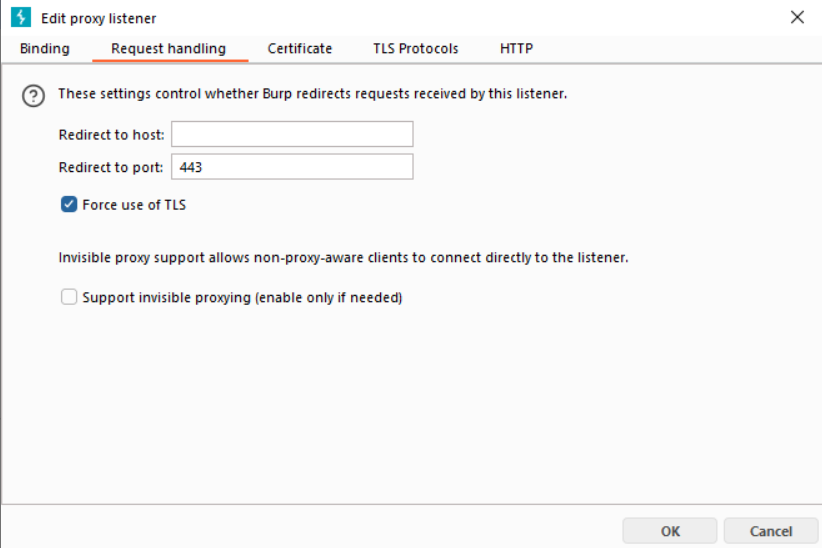.
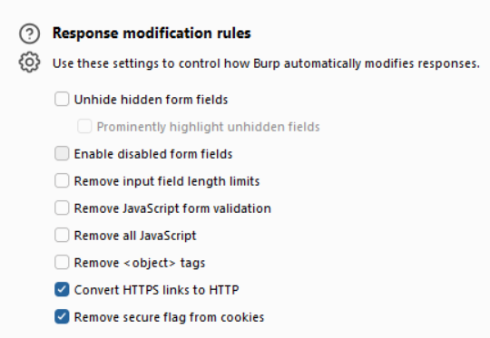


Then go to ```Settings → Proxy → Response Intercept Rules``` and check the box Intercept responses based on the following rule and make sure the rule for Content type header matches text is enabled.

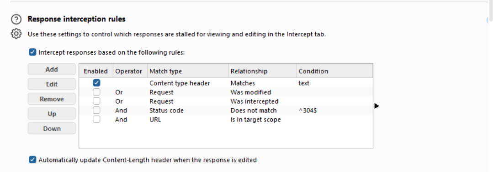

Another rule we need to add is in: ```Settings → Proxy → Match and replace rules → edit any rule by selecting it```. Edit it as follows:

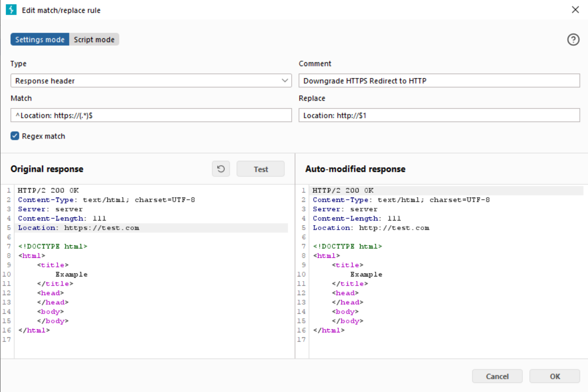


We can then Point the browser to the plain HTTP version of the target site and observe the potential impact.

For example we can acess http://www.goliardicats.it which does not have HSTS. Going to the login form and inputing our credentials: 
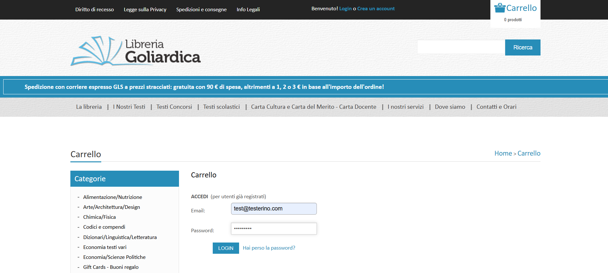

Looking at the http history we can see the credentials in plain text:
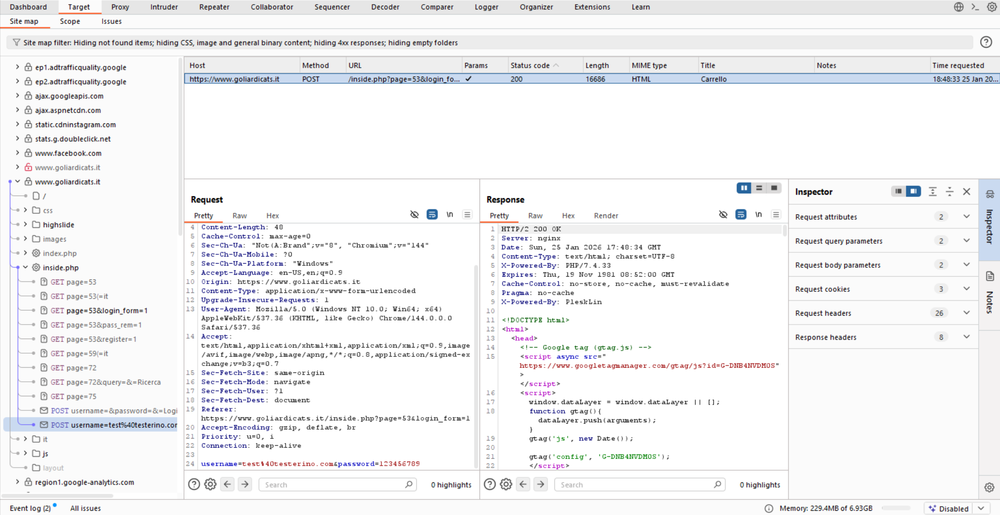

Another thing we could do is we could modify the response, for this we need to turn on intercept. As we saw, the response to the login form contained HTML code, we can remove it and add our own!

original:
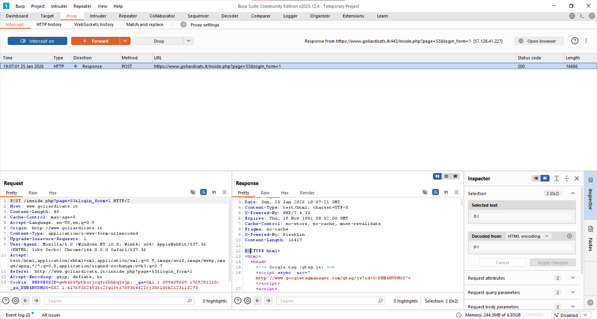
original result:
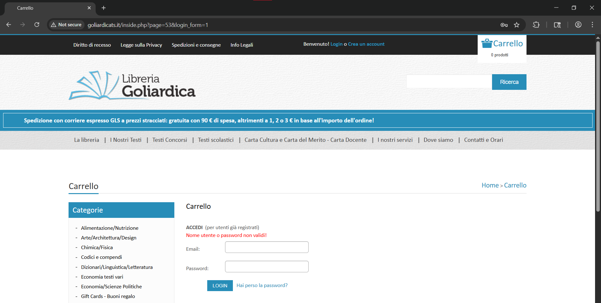
modified:
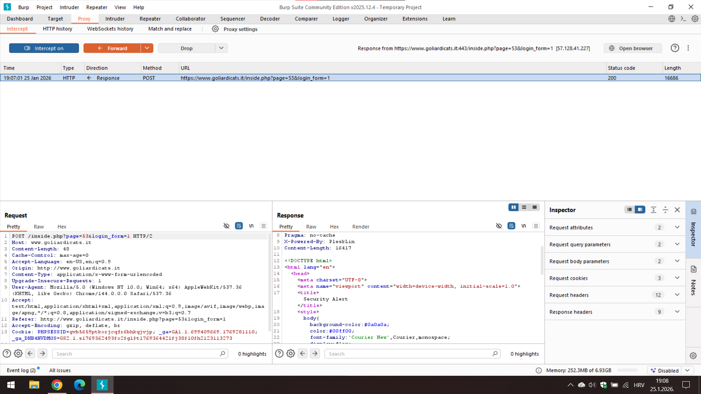
modified result:
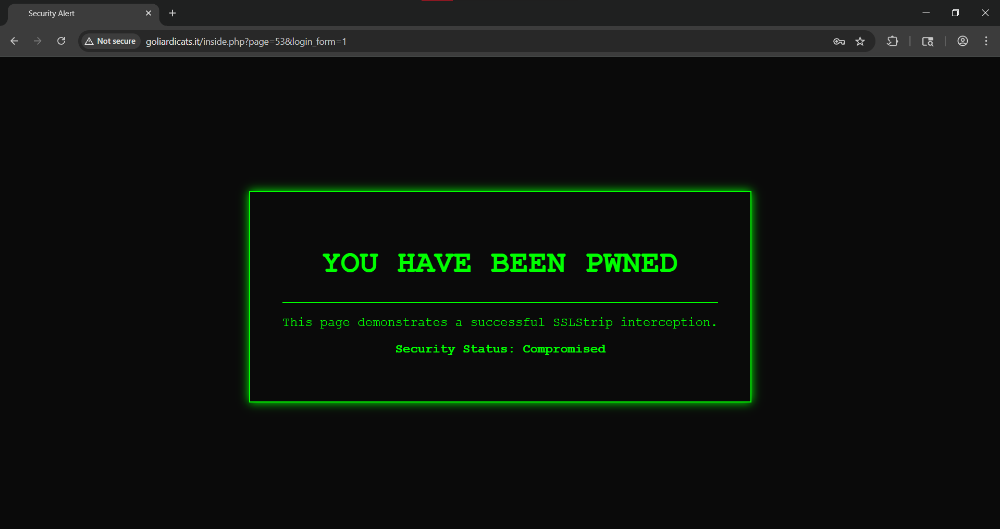


It is clear that the ramifications of this type of attack are huge. For example the modified webpage could be simmilar to the desired successful login page, making the user think he logged in while we silently steal his credentials and change his password, hijjacking his account. 

Also, if a user was on a banking page which does not use HSTS, and the user sends 1000$ to iban Y we could modify the request and send 10000$ to iban X, while modifying the server response so the user recieves a  payment confirmation page for the original 1000$, masking the theft entirely.

Essentially, if the victim fails to notice that the session has been downgraded to HTTP or if a valid certificate is installed on their device, the site continues to function normally. In this scenario, the victim has no reason to suspect that their plaintext data is being intercepted or manipulated in real time. This makes the exploit particularly dangerous.


## CASE B
The following activity builds on Case A by analyzing an SSLStrip attack against a website that implements Strict Transport Security (HSTS), using Burp Proxy to demonstrate how HSTS mitigates downgrade attacks depending on the site’s presence in the browser’s HSTS set.

The chosen website is www.apple.com. 

Looking at the HSTS status at: ```chrome://net-internals/#hsts``` we find that it is not listed there.

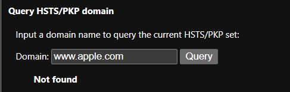

The same Burp configuration as in step A was used.

We have 3 possible HSTS statuses:

- Not Present (First Visit)
- Present (Subsequent visit)
- Preloaded (Always present)

### Case: Not Present (first visit)
We intercept a request for www.apple.com, note the Upgrade-Insecure-Requests: 1 header. THere is no need to set it to 0 since it does not prevent SSL stripping because it is only a browser preference, not an enforced security control. The header just signals that the browser would like to use HTTPS but Burp operates on the response after the request is sent, effectively ignoring the browser’s preference by responding with HTTP. In contrast, HSTS is mandatory and enforced by the browser, which explains why we need to remove the HSTS header in order to perform our attack.

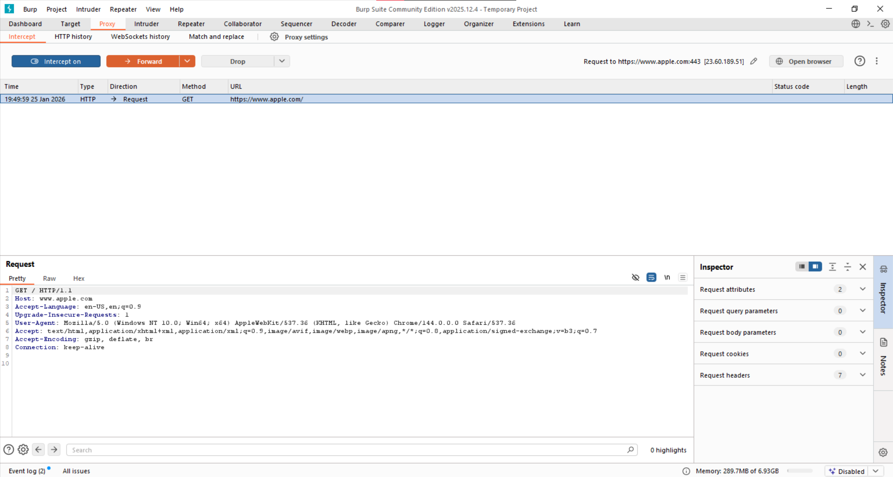

We then click on the watch series 11 page on the website:
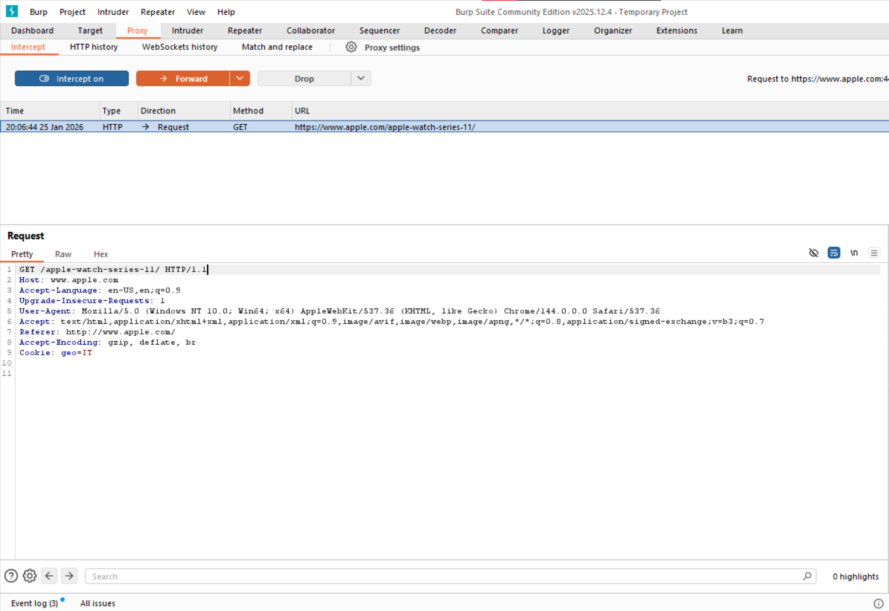

We can now remove the HSTS header and modify the HTML to our whishes:
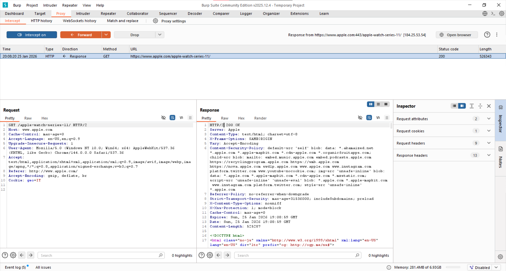 -> remove sts header and add my html

As a result we get:
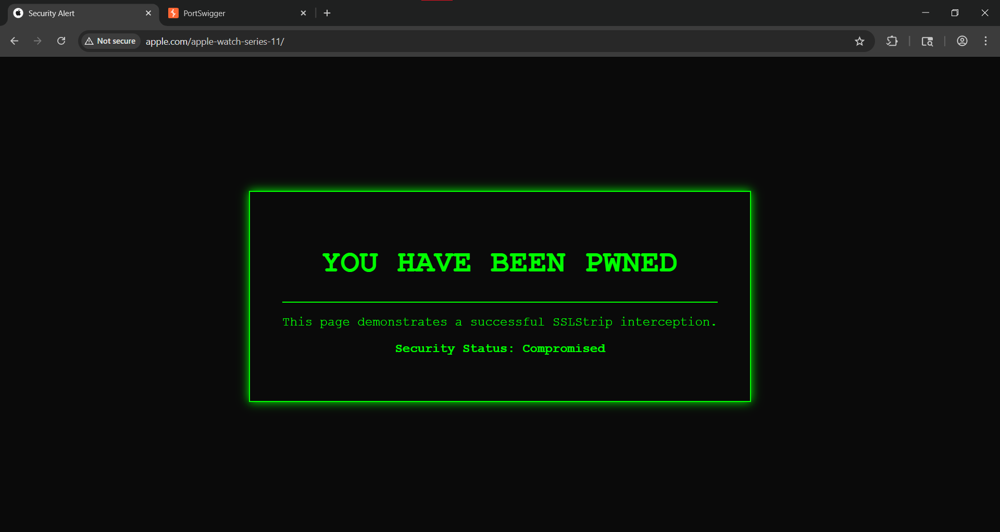


Proving that SSLstrip is possible in this case.


### Case: Present (Subsequent visit)
We first visit www.apple.com normally, withouth removing HSTS headers, and then repeat the same steps as in the previous case. 

Since visiting the Apple website did not load HSTS into the browser’s HSTS list (likely because Burp blocked it), we manually added apple.com and its subdomains. As shown below, the domain now appears in the HSTS list.

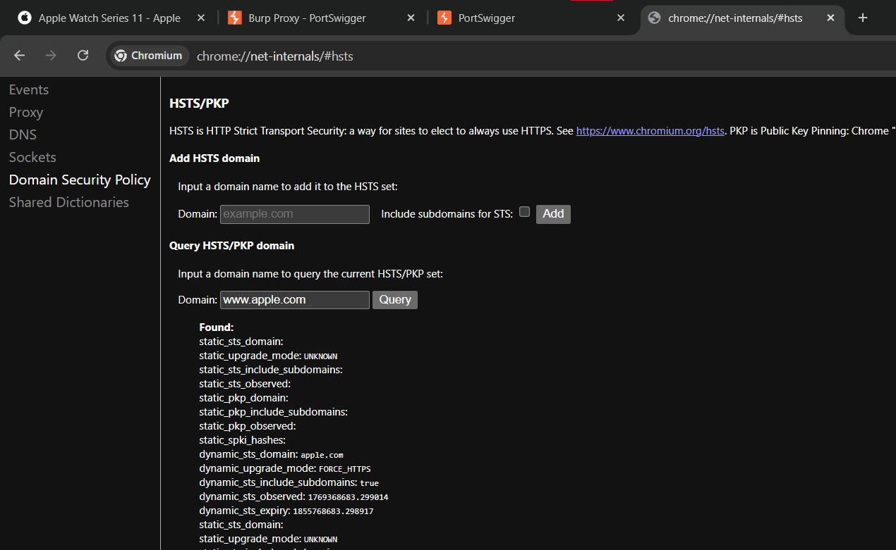

The next image shows that When attempting to access ```http://www.apple.com```, the browser automatically redirects the request to HTTPS, which is visible in the address bar. The HTTPS indicator is marked in red because the browser detects the Burp proxy certificate.

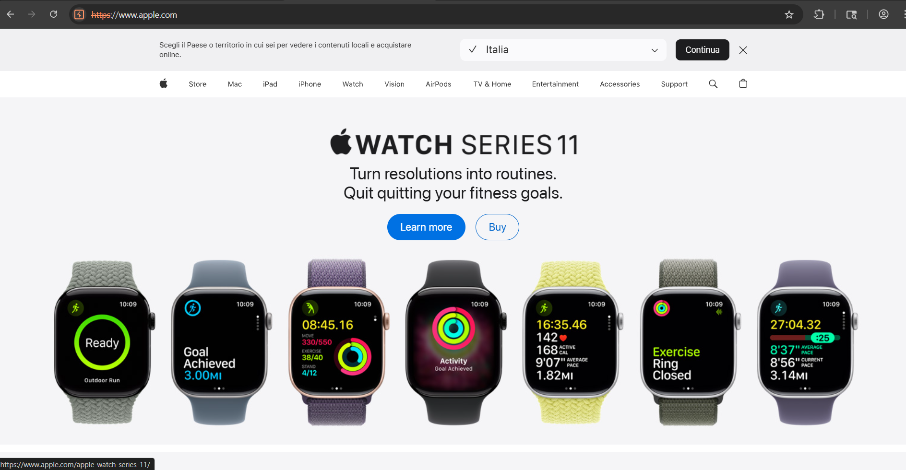


If we now turn on intercept and try to capture and modify data: 
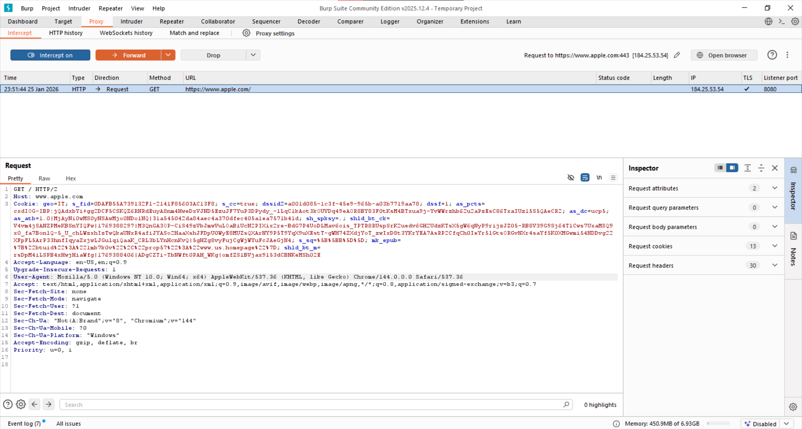

And if we now click on the watch series 11 page as before and modify the html in the response 

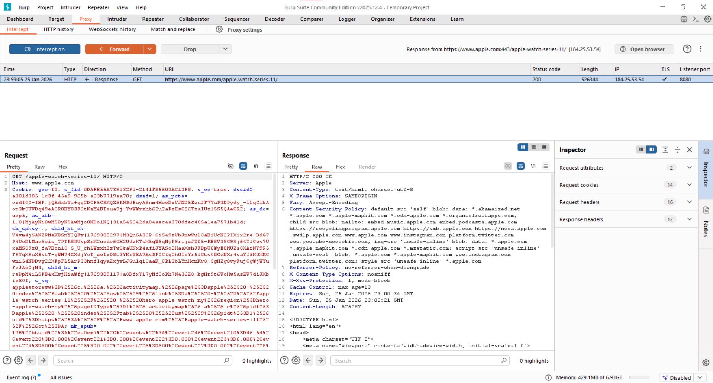

we get:

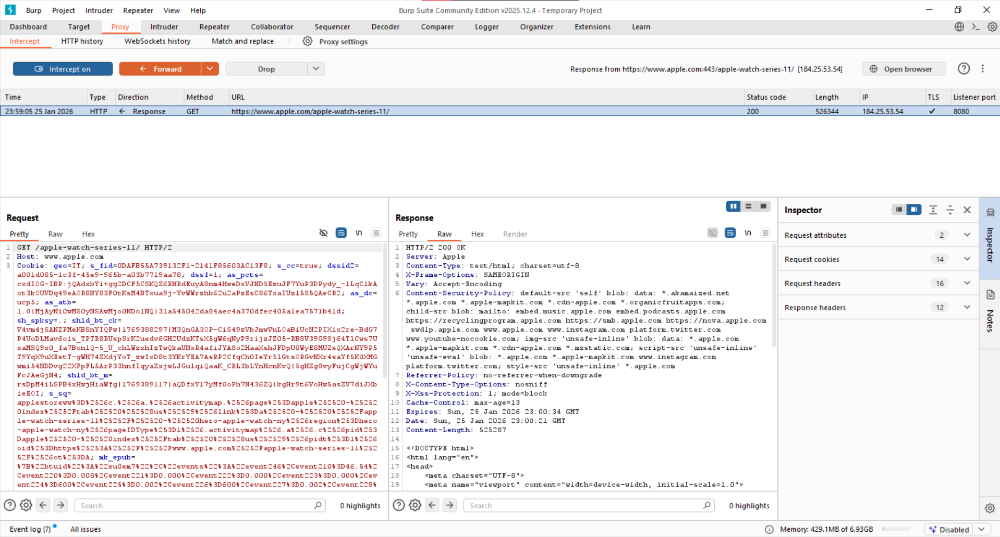

After enabling interception and modifying the HTML response as before, we observed that the attack still appeared to succeed. However, the reason is fundamentally different from the previous case. With HSTS enabled, all HTTP connections are forcibly upgraded to HTTPS, which is evident both in the browser UI and in the structure of the intercepted requests.

The attack works here not because HSTS was bypassed, but because the Burp browser explicitly trusts the PortSwigger CA. This allows Burp to issue a valid-looking certificate, decrypt HTTPS traffic, and modify responses. In a real-world scenario, where the attacker does not have a trusted certificate installed on the victim’s device, HSTS would fully prevent interception and modification of the traffic.

The key takeaway is that HSTS functioned correctly. The apparent success of the attack is due to a full Adversary in the middle (AITM) attack, which is far more powerful and unrealistic in typical real-world conditions.


### Case: Preloaded (Always present)
Preloaded HSTS domains significantly reduce the risk of SSL stripping because HTTPS enforcement is always active. There is no opportunity window for an attacker to interfere before HSTS is set or after the max-age expires. As a result, no additional experimentation is required: this case behaves the same as the previous one, but without any timing-based weaknesses, making SSL stripping effectively impossible.


## Conclusion
This lab activity allowed us to explore another dimension of the Burp Suite by using it in a fundamentally different way. In “normal” usage, Burp Proxy was employed to identify and exploit application-layer vulnerabilities such as SQL injection, where request parameters are modified without focusing on the underlying transport security. 
In this case, however, Burp was used to manipulate the communication itself between the client and the server, effectively controlling the communication channel. This required a broader understanding of how HTTP and HTTPS operate, how requests and responses are exchanged, and how security mechanisms such as HSTS influence this process. Overall, the lab highlighted the distinction between exploiting application logic flaws and attacking the security of the communication layer, providing a more comprehensive view of web security testing.


---

Jure Paus